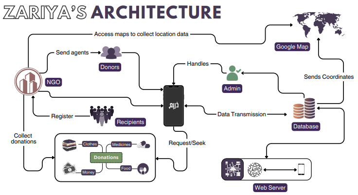
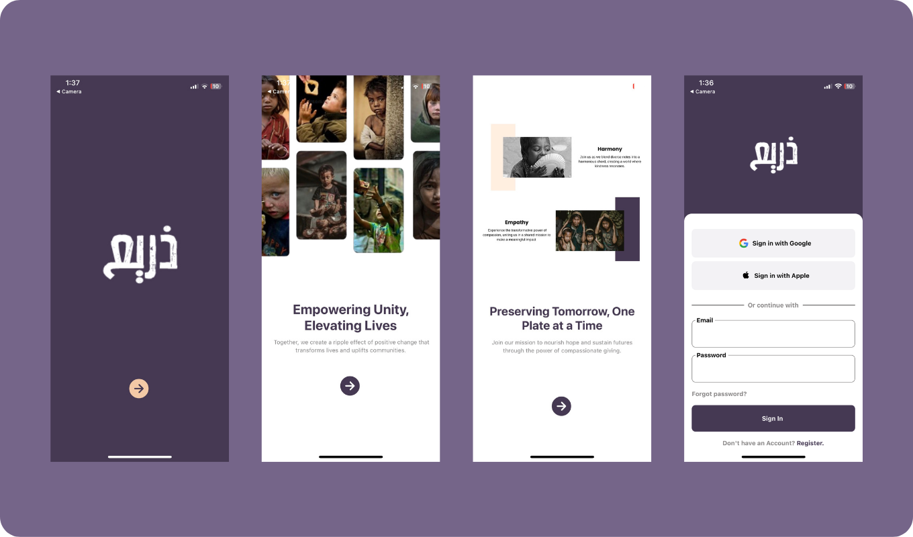
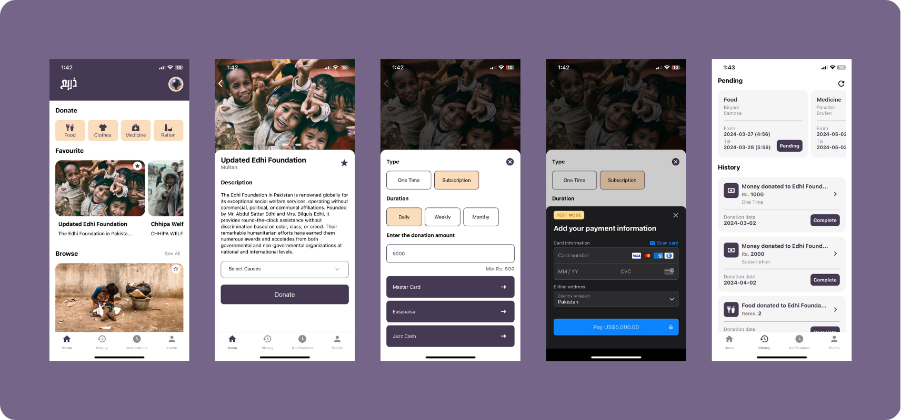

# Zariya

Zariya provides a platform to empower individuals and organizations alike to make a tangible impact toward the betterment of society. Our cross-platform application facilitates comprehensive philanthropy, addressing pressing issues such as hunger, clothing shortages, lack of essential rations, and limited access to medicine, all while preserving the dignity of those in need. A unique model involving providers, NGOs, and recipients acts as a bridge between surplus resources and those in need. In addition to our comprehensive philanthropy approach, Zariya also facilitates monetary contributions, opening the door for NGOs and Foundations dedicated to a wide range of noble causes like shelter homes, orphanages, old age homes.

## Authors

- [@sohaib](https://github.com/ssoohaib)
- [@eesha](https://github.com/eshawaqas)
- [@soban](https://github.com/sssoban)

## Architecture

## Screenshot

